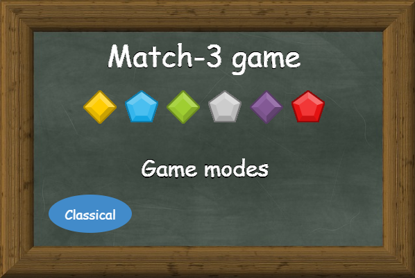
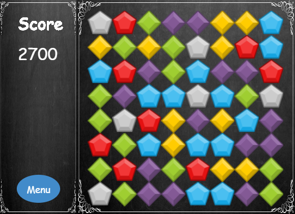

## Table of contents
* [General info](#general-info)
* [Technologies](#technologies)
* [Features](#features)
* [TODO](#TODO)
* [Installation](#installation)
* [Screenshots](#screenshots)

## General info
Match-3 game made using p5.js. You can play it here: https://risendy.github.io/match3GameP5js/

## Technologies
Project is created with:
* p5.js/p5.dom
* p5.collide2D - https://github.com/bmoren/p5.collide2D

## Features
* Welcome screen and 1 classical game mode

## TODO
* More game modes
* Better animations

## Installation
* Clone the repository
* Run file index.html

## Screenshots

### Homepage

### Classical game mode

